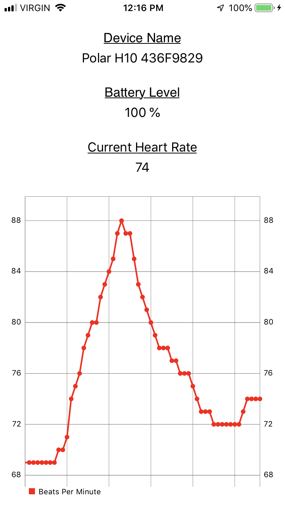

# SGHeartRate
Heart Rate Monitor app that reads from iOS bluetooth.

Written in Swift 4.2 with XCode 10.1.

Tested on iPhone and iPad on iOS 10.3.3 and 12.1.4.

Tested with "Polar H10 Heart Rate Monitor".  Should be compatible with any heart rate device that respects BLE GATT https://www.bluetooth.com/specifications/gatt/generic-attributes-overview.

If you have trouble connecting to "Polar H10 Heart Rate Monitor", please refer to https://support.polar.com/ca-en/support/FAQs/Troubleshooting_H7_heart_rate_sensor.

 
